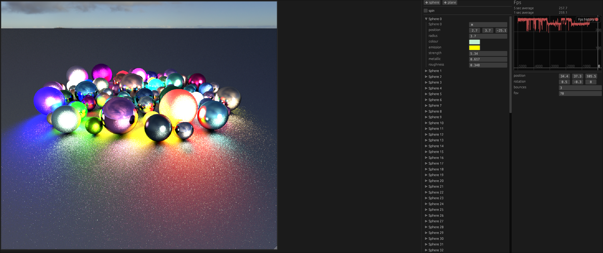

# RSRayTracingV3

A GPU ray tracer written in Rust for both desktop and web.

# Running

## Desktop

```bash
cargo run --release
```

## Web

Currently doesn't work, but if it did:

```bash
cd web
./build.sh
deno run server.ts
```

# Screenshots



# Assets

## Skybox

[Table Mountain 1 - Poly Haven](https://polyhaven.com/a/table_mountain_1)

The license is CC0.

